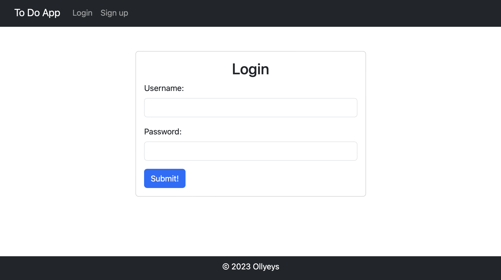
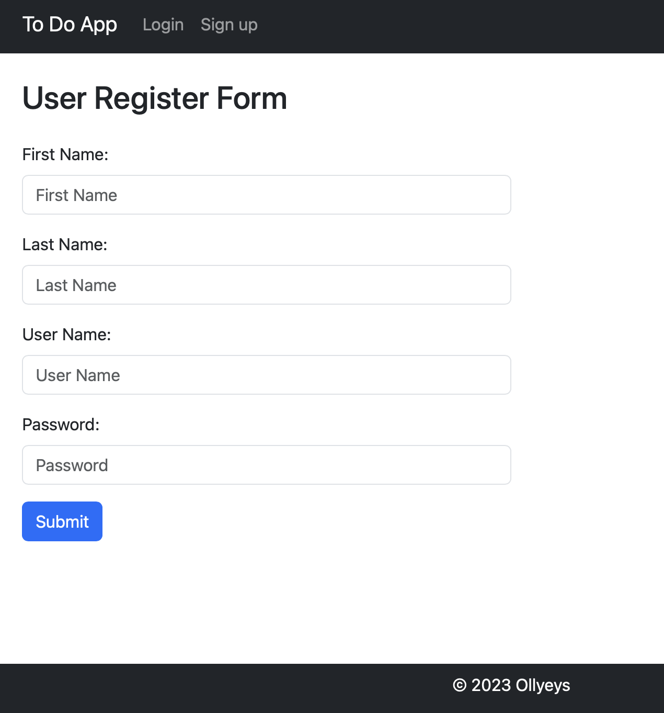
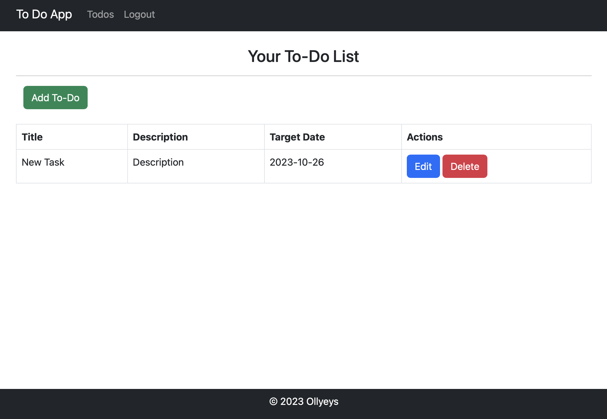
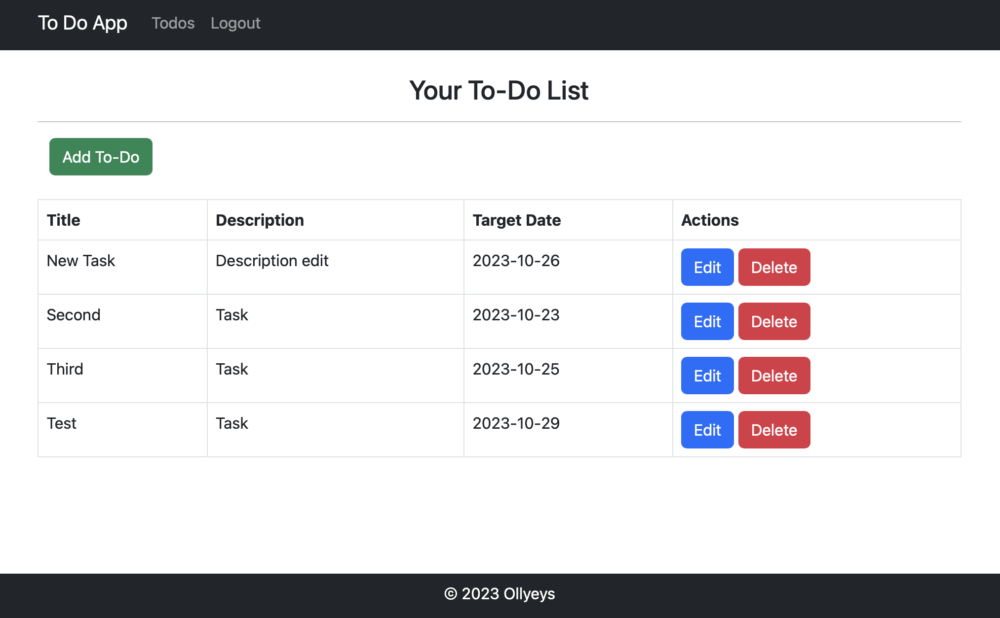

# To-Do Application

----

+ [О проекте](#О-проекте)
+ [Технологии](#Технологии)
+ [Использование](#Использование)
+ [Контакты](#Контакты)

## О проекте

----

MVC веб-приложение, представляет собой To-Do List. В этом приложении предоставляется 
возможность вести список дел. Для хранения данных используется MySQL база данных . 
В системе предусмотрена регистрация и авторизация для каждого пользователя.

## Технологии

----

+ Сборщик проектов **Maven**;
+ Backend - **Java 20**, ;
+ Хранение данных - **MySQL**; **JDBC API** 
+ Контейнер сервлетов - **Apache Tomcat**;
+ Frontend - **JSP**, **HTML**, **CSS**, **BOOTSTRAP**

## Использование

----

В начале работы с приложением нас встречает страница авторизации:

Если пользователь в системе не зарегистрирован, он может создать учетную запись во вкладке `"Sign up"`: 

После авторизации в системе пользователь перенаправляется на начальную страницу `"Todos"`, которая является основной - его списком задач.

Можно создать новую задачу, редактировать созданную или удалить ее (в скором времени функционал будет расширен :) )

## Контакты

----

Telegram: [@ollyeys](https://t.me/ollyeys) 
